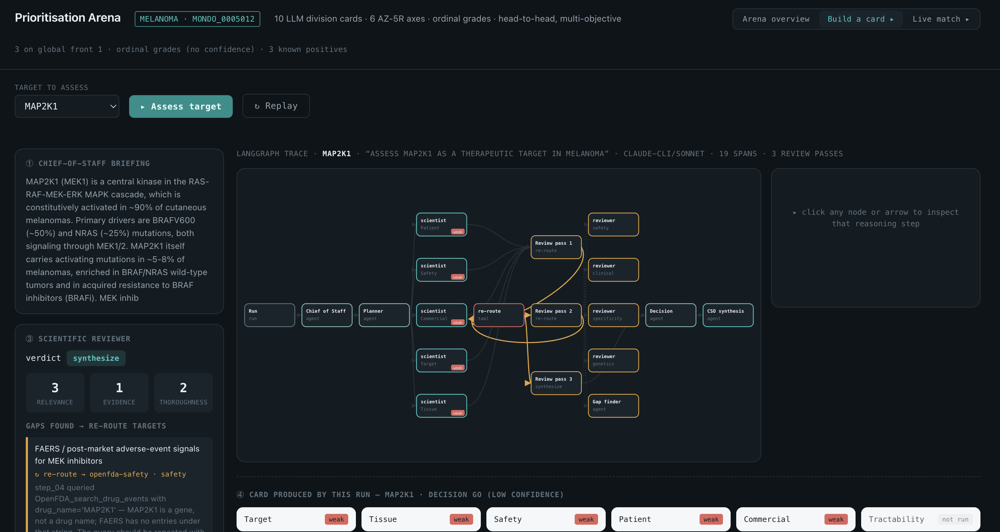
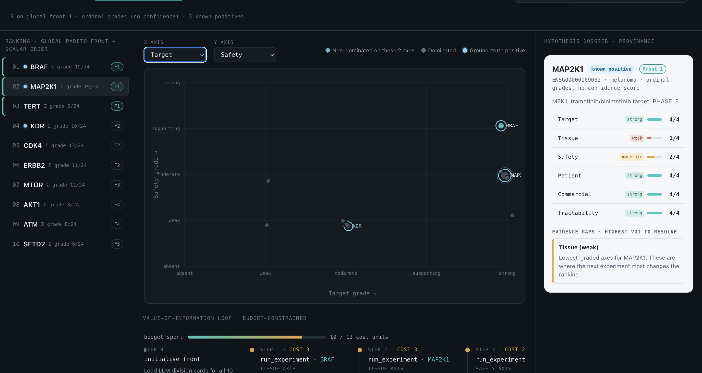

# Virtual Biotech Scientist

> A multi-agent AI scientist for drug-target discovery that **ranks competing therapeutic
> hypotheses in an arena** — built on the *Virtual Biotech* framework (Zhang et al. 2026),
> with [ToolUniverse](https://github.com/mims-harvard/ToolUniverse) as the tool layer and
> Claude as the reasoning engine.



> **"Build a card" mode** replays a *real* recorded run as an execution graph — a bare gene
> becomes a graded card. The amber back-arrows are the reviewer **re-routing** when it finds a
> gap (MAP2K1 ran 3 review passes; TERT ran 6). Nothing here is staged — it's straight from the
> trace. Open [`frontend/index.html`](frontend/index.html) to run it yourself.

📝 **Read the story:** [*I built a virtual biotech scientist over a weekend — here's what it taught me*](https://frombenchtobreakthrough.substack.com/p/i-built-a-virtual-biotech-scientist) — the why, the multi-agent design, and a worked PMEL run, on Substack.

This project stands on two pieces of prior work and adds one thing they lack:

- **[The Virtual Biotech](https://www.biorxiv.org/content/10.64898/2026.02.23.707551v1)**
  (Zhang, Eckmann, Miao, Mahon, Zou — Stanford, 2026) — a **CSO agent** orchestrating
  domain-specialist **scientist-agent divisions** that mirror a real therapeutics org. We adopt
  this org structure. Its assessment, however, is **absolute and per-hypothesis**: each candidate
  gets a narrative evidence dossier weighed in isolation — *there is no head-to-head comparison.*
- **[ToolUniverse](https://github.com/mims-harvard/ToolUniverse)** — the standardised tool layer
  (databases + in-silico models via MCP) the scientist agents call.

**What we add: the prioritisation arena.** We convert the paper's qualitative "weigh the divisions"
step into a **quantified, reproducible ranking** — competing **(target × disease × modality)
hypotheses** are pitted head-to-head, judged by a panel of division agents, and ranked as a
**multi-objective optimisation** (no single score: Pareto fronts across efficacy, safety,
tractability, novelty). A compute-budgeted loop spends evidence-gathering where it most changes the
ranking. See [docs/ARENA.md](docs/design/ARENA.md).

```
   query: "best target for lung cancer?"
        │
        ▼
   ┌─────────┐   delegates      ┌──────────────────────────────────────────┐
   │   CSO    │ ───────────────► │  SCIENTIST-AGENT DIVISIONS                │
   │  agent   │                  │   Target ID · Target Safety · Modality ·  │
   │          │ ◄─────────────── │   Disease biology · Clinical              │
   └────┬─────┘   evidence       └───────────────────┬──────────────────────┘
        │                                            │ tools
        │         ┌──────────────────┐               ▼
        │         │ Scientific       │      ToolUniverse MCP
        │ ◄─────► │ Reviewer (audit, │   OpenTargets · ChEMBL · EuropePMC ·
        │  gap →  │  re-route gap)   │   ADMET-AI · Boltz-2 · single-cell · …
        │  re-run └──────────────────┘
        ▼
   ┌────────────────────── PRIORITISATION ARENA ──────────────────────┐  ← our contribution
   │  competing (target × disease × modality) hypotheses              │
   │  pitted head-to-head → panel of division judges → ranked as a    │
   │  MULTI-OBJECTIVE optimisation (Pareto fronts, not one score)     │
   │  compute-budgeted: spend matches/evidence where rank is decided  │
   └──────────────────────────────────────────────────────────────────┘
```

## What we build on, and what we add

| Layer | Foundation | What this project adds |
| --- | --- | --- |
| **Org / agents** | Virtual Biotech (Zhang 2026): CSO → scientist divisions → reviewer loop | adopt directly (lighter, fewer divisions for a hackathon) |
| **Tools** | ToolUniverse: standardised MCP layer over 580+ databases + in-silico models | consume as the evidence layer |
| **Prioritisation** | both systems assess each hypothesis **in isolation** (narrative dossier; no comparison) | a **head-to-head arena** that produces a quantified, reproducible ranking |
| **Ranking method** | single weighed verdict / human pick | **multi-objective optimisation** — Pareto fronts across efficacy/safety/tractability/novelty, not one collapsed score |
| **Compute** | static, single-pass | **budgeted information-maximisation loop** — spend the next match/evidence call where it most changes the rank (VoI) |

> The unit ranked is a **therapeutic hypothesis** — *target × disease × modality × mechanism ×
> patient stratum* (e.g. "B7-H3, via an ADC, in LUAD, exploiting stromal overexpression") — exactly
> what the paper *outputs* and what an arena can compare. Not a bare gene.

**New to drug discovery?** Start with [docs/DRUG_DISCOVERY_PRIMER.md](docs/background/DRUG_DISCOVERY_PRIMER.md)
— a plain-English orientation for non-scientists (pipeline, target ID, prioritisation, worked example).

**What sets this apart:** see [docs/DIFFERENTIATION.md](docs/background/DIFFERENTIATION.md) — the loop closes onto
**real computation** via an MCP `run_experiment` interface (Boltz-2 live; single-cell + DNA/RNA-LM
registered stubs behind the same interface), driven by a Value-of-Information selector. We rank → act → re-rank, closing the loop the
paper leaves open.

**Suggested reading order:** [DRUG_DISCOVERY_PRIMER.md](docs/background/DRUG_DISCOVERY_PRIMER.md) (domain context)
→ [DESIGN.md](docs/design/DESIGN.md) → [ARENA.md](docs/design/ARENA.md) →
[INFORMATION_MAXIMISATION.md](docs/design/INFORMATION_MAXIMISATION.md) → [SELF_IMPROVING.md](docs/design/SELF_IMPROVING.md);
read [DIFFERENTIATION.md](docs/background/DIFFERENTIATION.md) before pitching, and treat
[REFERENCES.md](docs/background/REFERENCES.md) / [DIRECTIONS.md](docs/background/DIRECTIONS.md) as lookups.

See [docs/DESIGN.md](docs/design/DESIGN.md) for the CSO/division architecture,
[docs/ARENA.md](docs/design/ARENA.md) for the prioritisation arena (the core build),
[docs/INFORMATION_MAXIMISATION.md](docs/design/INFORMATION_MAXIMISATION.md) for where Value-of-Information
lives (rank continuously, collect only what could change the rank),
[docs/SELF_IMPROVING.md](docs/design/SELF_IMPROVING.md) for the self-improving-scientist angles (improve the
answer, the hypotheses, and the toolkit),
[docs/REFERENCES.md](docs/background/REFERENCES.md) for tools and citations, and
[docs/DIRECTIONS.md](docs/background/DIRECTIONS.md) for potential directions.

## See it in 30 seconds — no install, no LLM, no server

The fastest way to understand this project is the **interactive console** in [`frontend/`](frontend/).
It's a single self-contained page — no build, no dependencies, no network, no API keys.

```
open frontend/index.html      # macOS  (or just double-click it)
```



It replays **real recorded runs** of the system and lets you explore three views:

- **Arena overview** — the melanoma target ranking, the Pareto plot, and the compute-budgeted
  Value-of-Information loop.
- **Build a card** — watch the CSO evidence-collection loop turn a bare gene into a graded card,
  drawn as the actual LangGraph execution trace (BRAF ran 3 review passes, TERT ran 6 — straight
  from the trace, not staged).
- **Live match** — pit two targets head-to-head and watch the arena judge them step by step.

See [frontend/README.md](frontend/README.md) for how the data is recorded and regenerated.

## Status

**Working implementation**, not a design doc. The agent spine (CSO orchestrator, scientist
divisions, reviewer re-route loop), the prioritisation arena (match scheduler, panel judge,
Pareto ranker), the eval harness, and the no-build frontend are all in the tree. Recorded live
runs for 10 melanoma targets ship with the repo so you can inspect the system without keys.

## Repo layout

```
virtual-biotech-scientist/
├── README.md                     # this file
├── frontend/                     # no-build, no-LLM interactive console (start here)
│   ├── index.html                #   the whole app; open it in a browser
│   └── data/runs/                #   raw recorded live runs (result.json + trace.jsonl)
├── skills/virtual-biotech-cso/   # CSO orchestrator + scientist divisions + reviewer re-route loop
├── arena/                        # match scheduler, panel judge, Pareto ranker (pareto_agent/)
├── llm/ · common/                # LLM backend selection shared by CSO + arena
├── tools/                        # ToolUniverse / OpenTargets clients
├── eval/                         # case studies + ranking eval harness
├── scripts/                      # setup + local serve helpers
└── docs/                         # design (design/), background (background/), method (method/)
```
